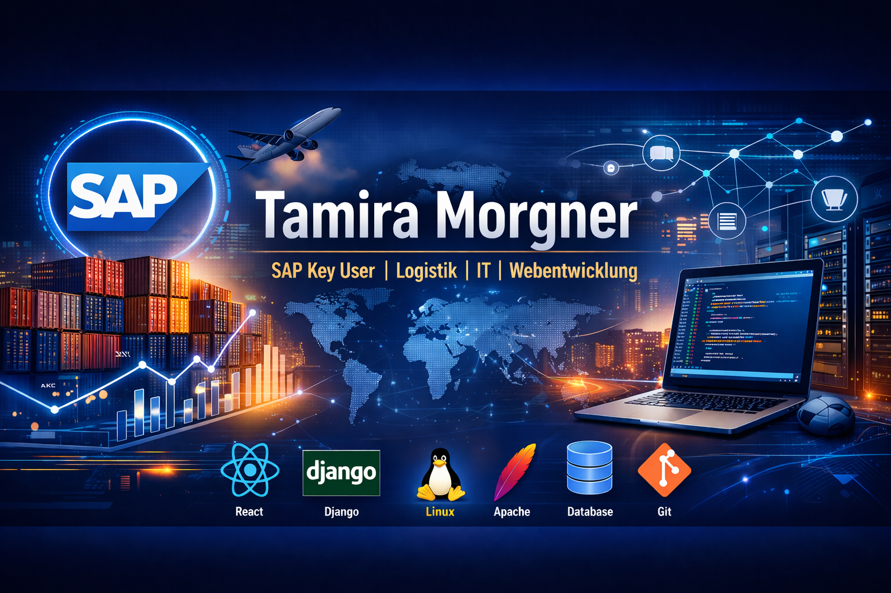

# 👋 Hi, ich bin Tamira

**SAP Key User | Logistik | IT | Webentwicklung**

Ich verbinde praktische Erfahrung in Logistikprozessen und ERP-Systemen mit eigener Webentwicklung und Linux-Serverbetrieb.

---

## 🚀 Über mich

* 💼 Erfahrung in Logistik & SAP (R/3 & HANA)
* 🖥️ Eigene Linux-Server & Deployment
* 🌐 Webentwicklung mit React & TypeScript
* ⚙️ Prozessoptimierung & Automatisierung
* 📊 Datenanalyse & Reporting

---

## 🛠️ Technologien

### 💻 Frontend

### ⚙️ Backend

### 🖥️ Infrastruktur

---

## 🧩 Projekte

### 📦 Smart Inventory Manager

Fullstack Webanwendung mit Django REST API & React

* JWT Authentifizierung
* Rollen: Admin / Lager / Viewer
* CSV Export
* Deployment mit Apache & Gunicorn

👉 [🌐 Live Demo](https://bewerbungsprofil.tamira12.duckdns.org/inventory/)
👉 [💻 GitHub](https://github.com/Tamira70/smart-inventory-manager)

---

### 📊 Crypto Dashboard

Interaktives Dashboard mit Live-Daten (CoinGecko API)

* TypeScript + Vite
* API Integration
* Marktstatistiken & Trends
* Eigenes Deployment

👉 [🌐 Live Demo](https://bewerbungsprofil.tamira12.duckdns.org/portfolio-dashboard/)
👉 [💻 GitHub](https://github.com/Tamira70/crypto-dashboard)

---

## 📊 GitHub Stats

---

## 🎯 Ziel

Ich suche eine Position im Bereich:

* SAP Key User / SAP Support
* IT / Systemadministration
* Webentwicklung (Frontend / Fullstack)

---

## 📫 Kontakt

* 📧 [tamira.morgner@web.de](mailto:tamira.morgner@web.de)

---

⭐ Ich freue mich über spannende Projekte und neue Herausforderungen!
