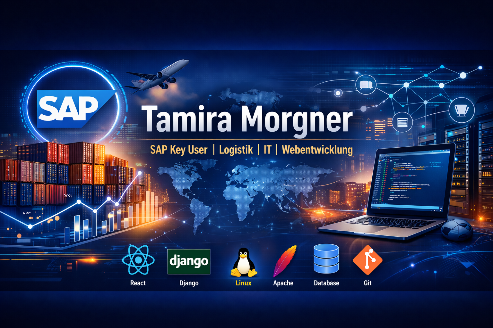

# 👋 Hi, ich bin Tamira

**SAP Key User | Logistik | IT | Webentwicklung**

Ich verbinde praktische Erfahrung in Logistikprozessen und ERP-Systemen mit eigener Webentwicklung, Linux-Serverbetrieb und Fullstack-Projekten.

---

## 🚀 Über mich

- 💼 Erfahrung in Logistik & SAP (R/3 & HANA)
- 🖥️ Eigene Linux-Server & Deployment
- 🌐 Webentwicklung mit React & TypeScript
- ⚙️ Prozessoptimierung & Automatisierung
- 📊 Datenanalyse & Reporting
- 🔐 Fullstack-Projekte mit Authentifizierung, API und Dashboard

---

## 🛠️ Technologien

### 💻 Frontend

### ⚙️ Backend

### 🖥️ Infrastruktur

---

## 🧩 Projekte

### 📦 Smart Inventory Manager

Fullstack-Webanwendung mit Django REST API & React zur Lagerverwaltung.

**Features:**

- JWT Authentifizierung
- Rollen: Admin / Lager / Viewer
- CSV Export
- Django Admin intern
- Deployment mit Apache & Gunicorn

👉 [🌐 Live Demo](https://bewerbungsprofil.tamira12.duckdns.org/inventory/)  
👉 [💻 GitHub](https://github.com/Tamira70/smart-inventory-manager)

---

### 🚀 Automatisierung Tool

Fullstack-Webanwendung zur digitalen Aufgaben- und Prozessverwaltung mit Django REST API, React, TypeScript und JWT-Authentifizierung.

**Features:**

- Benutzerregistrierung
- JWT Login & Token Refresh
- Demo-Zugang / Gastmodus
- Aufgaben erstellen, bearbeiten und löschen
- Kanban-Board mit Drag & Drop
- Listenansicht, Suche, Filter und Sortierung
- Dashboard mit Statistiken
- Diagramme mit Recharts
- Deployment mit Apache, Gunicorn & HTTPS

👉 [🌐 Live Demo](https://bewerbungsprofil.tamira12.duckdns.org/automatisierung-tool/)  
👉 [💻 GitHub](https://github.com/Tamira70/automatisierung-tool)

---

### 📊 Crypto Dashboard

Interaktives Dashboard mit Live-Daten aus der CoinGecko API.

**Features:**

- TypeScript + Vite
- Live API Integration
- Suche nach Coin & Symbol
- Marktstatistiken & Trends
- Eigenes Deployment mit Apache

👉 [🌐 Live Demo](https://bewerbungsprofil.tamira12.duckdns.org/portfolio-dashboard/)  
👉 [💻 GitHub](https://github.com/Tamira70/crypto-dashboard)

---

## 💼 Berufliche Schwerpunkte

- SAP Key User / SAP Support
- Logistikprozesse
- ERP-Systeme
- Prozessoptimierung
- Datenpflege & Reporting
- Schnittstelle zwischen Fachbereich und IT

---

## 🎯 Ziel

Ich suche eine Position im Bereich:

- SAP Key User / SAP Support
- IT / Systemadministration
- Webentwicklung Frontend / Fullstack
- Prozessdigitalisierung
- Datenanalyse & Automatisierung

---

## 📫 Kontakt

- 📧 [tamira.morgner@web.de](mailto:tamira.morgner@web.de)
- 💻 [GitHub: Tamira70](https://github.com/Tamira70)

---

⭐ Ich freue mich über spannende Projekte und neue Herausforderungen!
